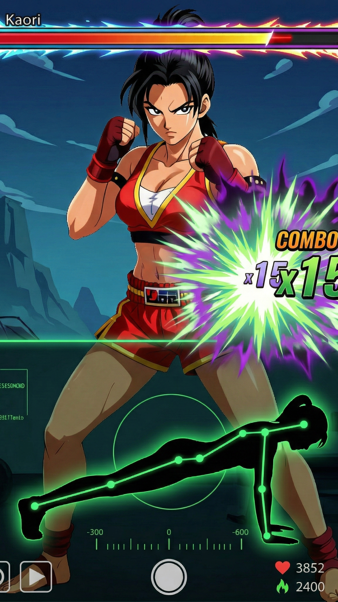

<div align="center">

# 💪 RepsRPG

**A fitness RPG that turns real pushups, squats and sit-ups into boss battles — your phone camera counts every rep.**


[](https://play.google.com/store/apps/details?id=com.abduloski.repsrpg)


<a href="https://play.google.com/store/apps/details?id=com.abduloski.repsrpg">
  
</a>

<p align="center">
  
  &nbsp;
  
  &nbsp;
  
</p>

</div>

---

## About

RepsRPG turns a workout into a role-playing game. Your phone's front camera runs **on-device ML Kit pose detection**, watches your form in real time, and counts each pushup, squat and sit-up as you do it. Every rep is an attack: you fight bosses, exploit their **elemental weaknesses**, earn XP, level up, and collect trophies — no manual tapping, the reps come from your actual body.

## Features

- 📷 **Live rep counting** from on-device pose detection (no manual input)
- 🔥💨💧 **Three exercises = three elements** — Pushups (Fire), Squats (Air), Sit-ups (Water)
- ⚔️ **Boss battles** with an elemental weakness system (pick the right exercise for 2× damage)
- 📈 **XP & leveling** with a no-cap scaling curve
- 🏆 **Trophies** for defeating bosses
- ☁️ **Offline-first** with background cloud sync

---

## Under the Hood

A few pieces I'm happy with. Full files are in [`snippets/`](snippets/).

### 📐 Rep counting by joint angles

Reps aren't tapped — they're *detected*. This computes the angle at a joint from three pose landmarks (e.g. shoulder → elbow → wrist), and the rep detector watches that angle cross thresholds (extended → flexed → extended = one pushup). → [`snippets/AngleCalculator.kt`](snippets/AngleCalculator.kt)

```kotlin
fun calculateAngle(pointA: LandmarkPoint, pointB: LandmarkPoint, pointC: LandmarkPoint): Float {
    val vectorBA = Pair(pointA.x - pointB.x, pointA.y - pointB.y)
    val vectorBC = Pair(pointC.x - pointB.x, pointC.y - pointB.y)

    val angleBA = atan2(vectorBA.second.toDouble(), vectorBA.first.toDouble())
    val angleBC = atan2(vectorBC.second.toDouble(), vectorBC.first.toDouble())

    var angle = Math.toDegrees(angleBA - angleBC).toFloat()
    if (angle < 0) angle += 360f
    if (angle > 180f) angle = 360f - angle
    return angle
}
```

### ✨ Floating "+reps" animation (Compose)

Each counted rep pops a number that drifts up, scales and fades — a small self-contained Compose animation driven by `animateFloatAsState` and a `graphicsLayer`. → [`snippets/FloatingRepNumber.kt`](snippets/FloatingRepNumber.kt)

```kotlin
val offsetY by animateFloatAsState(
    targetValue = when (animationState) { 0 -> 0f; else -> -150f },
    animationSpec = tween(durationMillis = 800, easing = LinearOutSlowInEasing),
    label = "offsetY"
)
// alpha + scale animate the same way…

LaunchedEffect(reps) { animationState = 0; delay(50); animationState = 1 }

Text(
    text = "+$reps",
    modifier = modifier
        .graphicsLayer { translationY = offsetY; scaleX = scale; scaleY = scale }
        .alpha(alpha)
)
```

### 🦴 17-point pose model

A clean domain model for the skeleton ML Kit returns, with **confidence gates** so a rep only counts when the relevant joints are actually visible — no phantom reps from a half-detected body. → [`snippets/PoseData.kt`](snippets/PoseData.kt)

```kotlin
data class PoseData(
    val leftShoulder: LandmarkPoint = LandmarkPoint.EMPTY,
    val leftElbow: LandmarkPoint = LandmarkPoint.EMPTY,
    val leftWrist: LandmarkPoint = LandmarkPoint.EMPTY,
    // …17 joints total…
) {
    fun hasValidUpperBody(minConfidence: Float = 0.5f): Boolean {
        return leftShoulder.confidence >= minConfidence &&
                leftElbow.confidence >= minConfidence &&
                leftWrist.confidence >= minConfidence
                // …and the right side
    }
}
```

### 🔥 Exercises as elements

The game-design hook in a few lines: each exercise maps to an element, and bosses have weaknesses — so choosing what to do is tactical, not just physical. → [`snippets/Element.kt`](snippets/Element.kt)

```kotlin
enum class Element(val displayName: String, val emoji: String, val iconRes: Int) {
    FIRE("Fire", "🔥", R.drawable.fire),    // Pushups
    AIR("Air", "💨", R.drawable.air),        // Squats
    WATER("Water", "💧", R.drawable.water);  // Sit-ups

    companion object {
        fun fromExerciseType(type: ExerciseType): Element = when (type) {
            ExerciseType.PUSHUPS -> FIRE
            ExerciseType.SQUATS  -> AIR
            ExerciseType.SITUPS  -> WATER
        }
    }
}
```

---

## Built with

- **Language:** Kotlin
- **UI:** Jetpack Compose + Material 3
- **Pose / camera:** ML Kit Pose Detection · CameraX
- **Data:** Room (local) + Firebase Firestore (cloud sync)
- **Async:** Coroutines / Flow · WorkManager

## Privacy

[Privacy Policy](https://x-haris.github.io/repsrpg-privacy/)
